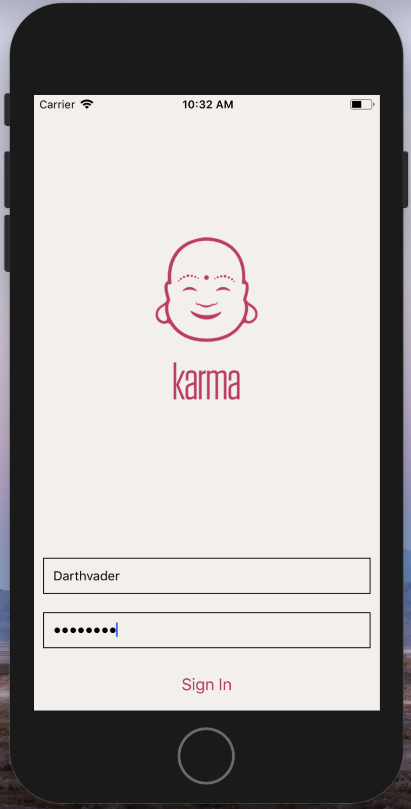
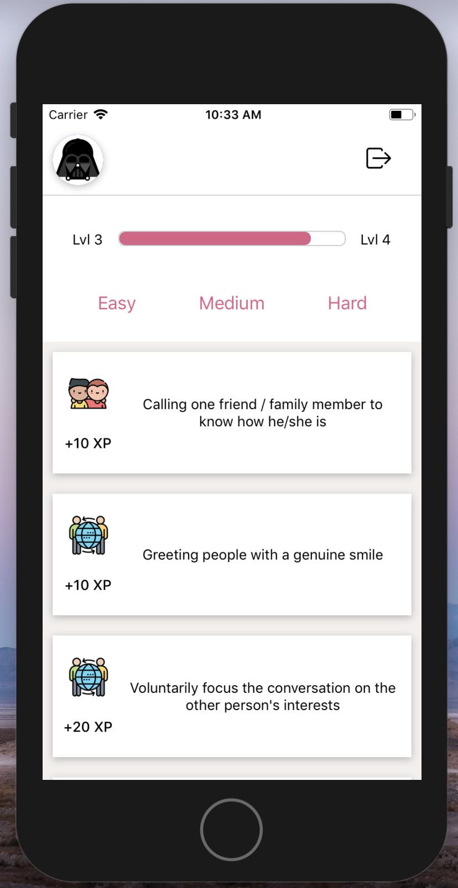

# Karma

"Do good and good will come to you!"

Society is more and more moving towards an individualistic culture. Karma helps you to get ideas of how you can change this trend while gaining experience points for completed good actions.

### Screenshot

 LOGIN | MAIN | SUCCESS
| ------------- | ------------- | ------------- |
|  |  | 

   

### Installation
To run the app you need to clone Karma-Server and Karma-Client repositories. Also you will have to install the latest version of expo client and either and iOs simulator or and Android emulator. For the backend you need to have node.js and mongodb installed.

### Client
* git clone https://github.com/steelersbcn/karma-client
* npm install

### Server
* git clone https://github.com/steelersbcn/karma-server
* npm install

### to run it
* Server
   * mongod
   * npm run start:dev

### to run it
* Client
   * npm start

### Tech Stack
* React Native
* Expo
* Koa
* Mongoose
* MongoDB

### Developer
###### Florian Jost (@steelersbcn)
